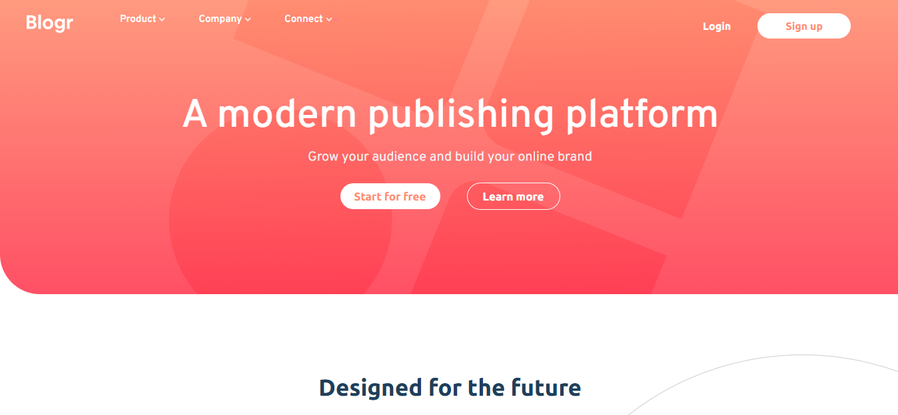

# Frontend Mentor - Blogr landing page solution

This is a solution to the [Blogr landing page challenge on Frontend Mentor](https://www.frontendmentor.io/challenges/blogr-landing-page-EX2RLAApP). Frontend Mentor challenges help you improve your coding skills by building realistic projects. 

## Table of contents

- [Overview](#overview)
  - [The challenge](#the-challenge)
  - [Screenshot](#screenshot)
  - [Links](#links)
- [My process](#my-process)
  - [Built with](#built-with)
  - [What I learned](#what-i-learned)
  - [Continued development](#continued-development)
- [Author](#author)


## Overview

### The challenge

Users should be able to:

- View the optimal layout for the site depending on their device's screen size
- See hover states for all interactive elements on the page

### Screenshot




### Links

- Solution URL: [Add solution URL here](https://your-solution-url.com)
- Live Site URL: [Add live site URL here](https://your-live-site-url.com)

## My process

### Built with

- Semantic HTML5 markup
- CSS custom properties
- Flexbox
- JavaScript

### What I learned

I learnt a lot involving drop down menus, navigation bars, hambuger and close button, etc

```html

      <div class="open">
          
        </div>

        <div class="close">
          
        </div>

      <div class="link-and-register">
        <div class="head-logo">
          
        </div>

        <div class="mobile-issues" id="mobileIssues">

        <div class="head-links-list">
          <ul>
            <li class="links">Product </li>
            <li class="links">Company </li>
            <li class="links" id="connect" >Connect 
              
              <div class="connect-dropdown">
              <ul>
                <li>Contact</li>
                <li>Newsletter</li>
                <li>Linkedin</li>
                
              </ul>
            </div>
            </li>

            

            
          </ul>
          
        </div>

        

        <div class="register">
          <div class="mobile-border"></div>
          <p class="login">Login</p>
          <p class="sign-up">Sign up</p>
        </div>

        </div>
      </div>
```
```css


.head-links{
    padding: 40px;
    max-height: 600px;
    border-bottom-left-radius: 60px;
    font-family: "Overpass", sans-serif;
      min-height: 70vh;

  background:
    linear-gradient(
      rgba(255, 143, 113, 0.9),
      rgba(255, 61, 84, 0.9)
    ),
    url("assets/bg-pattern-intro-desktop.svg");

  background-repeat: no-repeat;
  background-position: center;
  background-size: cover;
  position: relative;

}

.link-and-register{
    display: flex;
    align-items: center;
    margin-top: -20px;
    gap: 70px;
}


.head-links-list ul{
    display: flex;
    position: relative;
    gap: 50px;
    list-style: none;
    color: white;
    font-weight: 600;
    font-size: 15px;
}


.head-links ul li:hover{
    text-decoration: underline;
    cursor: pointer;
}


/* CONNECT DROP DOWN */

.connect-dropdown ul{
    display: flex;
    flex-direction: column;
    margin-top: 10px;
    margin-left: -5px;
    gap: 10px;
    background-color: white;
    color: grey;
    padding: 25px;
    width: 150px;
    border-radius: 5px;
    box-shadow: 0px 3px 6px rgba(0,0,0,0.1);
    position: absolute;
      opacity: 0;
  transform: translateY(-10px);
  pointer-events: none;

  transition: 
    opacity 0.3s ease,
    transform 0.3s ease;

    
} 

.connect-dropdown ul.active{
    text-decoration: none;
     opacity: 1;
  transform: translateY(0);
  pointer-events: auto;
}

.connect-dropdown ul li:hover{
    text-decoration: none;
    cursor: pointer;
    color: black;
}

.arrow-connect{
    transition: transform 0.3s ease;
    display: inline-block;
    
}

.arrow-connect.show{
    transform: rotate(180deg);
}

/* Mobile arrow */
.mobile-arrow{
    display: none;
}


.sign-up{
    background-color: white;
    color: hsl(13, 100%, 72%);
    padding: 10px;
    width: 140px;
    display: flex;
    justify-content: center;
    border-radius: 30px;
}

.sign-up:hover{
    color: white;
    background-color: hsl(13, 85%, 73%);
    cursor: pointer;
}

.head-word{
    display: flex;
    flex-direction: column;
    justify-content: center;
    align-items: center;
    margin-top: 80px;
    color: white;
    font-family: "Overpass", sans-serif;
    
}

.head-h1{
    font-weight: 500;
    font-size: 60px;
}

.head-p{
    margin-top: 10px;
    font-size: 20px;
    color: rgb(241, 239, 239);
}

.proceed{
    display: flex;
    gap: 40px;
    margin-top: 25px;
    font-family: "Ubuntu", sans-serif;
    font-weight: 600;
}

.proceed-one{
    font-size: 17px;
    background-color: white;
    color: hsl(13, 100%, 72%);
    padding: 10px;
    width: 150px;
    border-radius: 30px;
    display: flex;
    align-self: center;
    justify-content: center;
}

.proceed-one:hover{
    cursor: pointer;
    color: white;
    background-color: hsl(13, 85%, 73%);
    border: 1px solid white;
}

.proceed-two{
    font-size: 17px;
    border: 1px solid white;
    padding: 10px;
    border-radius: 30px;
     display: flex;
    align-self: center;
    justify-content: center;
    width: 140px;
}

.proceed-two:hover{
    background-color: white;
    color: hsl(13, 100%, 72%);
    cursor: pointer;
}

.main-head-h2{
    margin-top: 120px;
    display: flex;
    justify-content: center;
}

.head-h2{
    font-family: "Ubuntu", sans-serif;
    color: hsl(208, 49%, 24%);
    font-size: 35px;
}

/* FIRST CARD */

.first-card{
    display: flex;
    margin-top: -70px;
    justify-content: space-between;
    position: relative;
  overflow-x: hidden;   /* 🔑 stops horizontal scroll */
  display: flex;
  align-items: center;
    
}

.first-card-image {
  position: relative;
  flex: 1;
}

.first-card-pic {
    margin-left: 20%;
    max-width: none;      /* IMPORTANT */
    width: 65vw;
}

/* FIRST CARD WORDS */

.first-card-words{
    margin-top: 6vw;
    margin-left: 70px;
    display: flex;
    flex-direction: column;
    gap: 40px;
    font-family: "Ubuntu", sans-serif;
    width: 100vw;
}

/* FIRST CARD ONE */

.first-card-words-one{
    gap: 25px;
    display: flex;
    flex-direction: column;
}

.h3-first-one{
    color: hsl(208, 49%, 24%);
    font-size: 25px;
}

.p-first-one{
    width: 36vw;
    font-family: "Ubuntu", sans-serif;
    line-height: 1.9;
    color: hsl(207, 13%, 34%);
    font-weight: 410;
}

/* FIRST CARD TWO */

.first-card-words-two{
    gap: 25px;
    display: flex;
    flex-direction: column;
}

.h3-first-two{
    color: hsl(208, 49%, 24%);
    font-size: 25px;
}

.p-first-two{
    width: 36vw;
    font-family: "Ubuntu", sans-serif;
    line-height: 1.9;
    font-weight: 410;
    color: hsl(207, 13%, 34%);
}

/* SECOND CARD */

.second-card{
    margin-top: 10vw;
    display: flex;
    align-items: center;
    gap: 10%;
    /* background-color:  hsl(240, 10%, 16%); */
    background: hsl(240, 10%, 16%) url("assets/bg-pattern-circles.svg")  ;

    height: 350px; 

    background-repeat: no-repeat;
  background-position: bottom left;
  background-size: 40% auto;
  border-bottom-left-radius: 70px;
  border-top-right-radius: 70px;
}

.second-card-words{
    display: flex;
    flex-direction: column;
    gap: 30px;
}

.h3-second-card{
    color: white;
    font-size: 25px;
    font-family: "Overpass", sans-serif;
}

.p-second-card{
    color: white;
    font-family: "Overpass", sans-serif;
    width: 70%;
    line-height: 1.7;
    font-size: 15px;
}

/* THIRD CARD */

.third-card{
    display: flex;
    margin-top: 10%;
    align-items: center;
    overflow: hidden;
    position: relative;
    justify-content: space-between;
}

.third-card-image{
    position: relative;
    flex: 1;
}

.third-card-pic{
    margin-left: -29%;
    max-width: none;      /* IMPORTANT */
    width: 60vw;
  
}

/* THIRD CARD WORDS */

.third-card-words{
    display: flex;
    flex-direction: column;
    gap: 40px;
    margin-left: -40px;
}

.third-card-words-one{
    display: flex;
    flex-direction: column;
    gap: 20px;
    margin-top: -10px;
}

.h3-third-one{
    color: hsl(208, 49%, 24%);
    font-size: 25px;
    font-family: "Overpass", sans-serif;
}

.p-third-one{
    line-height: 1.7;
    font-family: "Overpass", sans-serif;
    color: grey;
    width: 90%;
}

/* SECOND PARAGRAPH OF THE THIRD CARD */

.third-card-words-two{
    display: flex;
    flex-direction: column;
    gap: 20px;
}

.h3-third-two{
    color: hsl(208, 49%, 24%);
    font-size: 25px;
    font-family: "Overpass", sans-serif;
}

.p-third-two{
    line-height: 1.7;
    font-family: "Overpass", sans-serif;
    color: grey;
    width: 90%;
}

/* FOOTER */

.footer{
    margin-top: 60px;
    background-color:  hsl(240, 10%, 16%);
    padding: 100px;
    border-top-right-radius: 80px;
    display: flex;
    justify-content: flex-start;
    gap: 20%;
}

.footer-logo{
    width: 10%;
    height: 30%;
    
}

/* FOOTER LIST */

.footer-list{
    display: flex;
    gap: 90%;
    margin-top: 8px;
    font-family: "Overpass", sans-serif;
} 

.footer-list:hover{
    cursor: pointer;
}


/* FIRST FOOTER LIST */
.list-one{
    display: flex;
    flex-direction: column;
    gap: 30px;
}

.list-one-h4{
    color: white;
    font-size: 20px;
}

.list-one-items ul{
    color: grey;
    list-style: none;
    display: flex;
    flex-direction: column;
    gap: 15px;
}

.list-one-items ul li:hover{
    cursor: pointer;
    text-decoration: underline;
}

/* SECOND FOOTER LIST */
.list-two{
    display: flex;
    flex-direction: column;
    gap: 30px;
}

.list-two-h4{
    color: white;
    font-size: 20px;
}

.list-two-items ul{
    color: grey;
    list-style: none;
    display: flex;
    flex-direction: column;
    gap: 15px;
}

.list-two-items ul li:hover{
    cursor: pointer;
    text-decoration: underline;
}

/* THIRD FOOTER LIST */
.list-three{
    display: flex;
    flex-direction: column;
    gap: 30px;
}

.list-three-h4{
    color: white;
    font-size: 20px;
}

.list-three-items ul{
    color: grey;
    list-style: none;
    display: flex;
    flex-direction: column;
    gap: 15px;
}

.list-three-items ul li:hover{
    cursor: pointer;
    text-decoration: underline;
}

/* MOBILE FEATURES NOT FOR DESKTOP VIEW */

.open, .close{
    display: none;
}

.mobile-border{
    display: none;
}
.mobile-issues{
    display: flex;
    justify-content: space-between;
}

.register{
    display: flex;
    gap: 40px;
    margin-left: 40vw;
    color: white;
    font-family: "Ubuntu", sans-serif;
    font-weight: 600;
    align-items: center;
}

```
```js
const connect = document.getElementById("connect");
const arrowDown = document.querySelector(".arrow-connect");
const connectDropdown = document.querySelector(".connect-dropdown ul");
const mobileArrow = document.querySelector(".mobile-arrow-one");
const mobileIssues = document.getElementById("mobileIssues");
const closeBtn = document.querySelector(".close");
const openBtn = document.querySelector(".open");

connect.addEventListener("click", (e) => {
    connectDropdown.classList.toggle("active");
    arrowDown.classList.toggle("show");
    mobileArrow.classList.toggle("show");
});

openBtn.addEventListener("click", () => {
    mobileIssues.classList.add("live");
    openBtn.classList.add("live");
    closeBtn.classList.add("live");
});

closeBtn.addEventListener("click", () => {
    mobileIssues.classList.remove("live");
    openBtn.classList.remove("live");
    closeBtn.classList.remove("live");
});

document.addEventListener("click", (e) => {
    if(!connect.contains(e.target)){
        connectDropdown.classList.remove("active");
        arrowDown.classList.remove("show");
    }

});
```

### Continued development
I still need tpo learn more about CSS and JavaScript.


## Author
- Frontend Mentor - [@Wizdev0](https://www.frontendmentor.io/profile/Wizdev0)
- Twitter - [@otutech](https://www.twitter.com/otutech)
